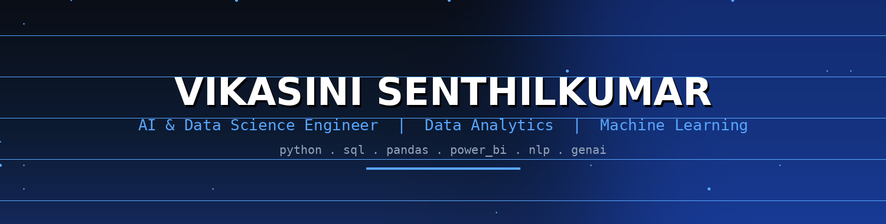

<!-- ====================================================== -->
<!--                    HERO BANNER                         -->
<!-- ====================================================== -->

<div align="center">



<br><br>


<br><br>


<br><br>

<a href="https://github.com/vikasinisenthilkumar52-hash">

</a>

<a href="https://www.linkedin.com/in/vikasini-s-aa48932a4/">

</a>

<a href="mailto:vikasinisenthilkumar52@gmail.com">

</a>

</div>

<br>

---

<!-- ====================================================== -->
<!--                    TERMINAL INTRO                       -->
<!-- ====================================================== -->

<div align="center">

## 💻 `terminal://vikasini`

</div>

```text
┌──────────────────────────────────────────────────────────────┐
│                                                              │
│  $ whoami                                                    │
│                                                              │
│  Vikasini Senthilkumar                                      │
│  AI & Data Science Student                                  │
│  Aspiring Data Analyst                                      │
│                                                              │
│  $ mission                                                   │
│                                                              │
│  Turning raw data into meaningful insights                   │
│  and building practical AI-driven solutions.                 │
│                                                              │
│  $ current_status                                            │
│                                                              │
│  [✓] Learning Python                                         │
│  [✓] Exploring SQL                                           │
│  [✓] Building Power BI dashboards                            │
│  [✓] Practicing Data Analytics                               │
│  [→] Learning Machine Learning                               │
│  [→] Exploring Generative AI                                 │
│                                                              │
└──────────────────────────────────────────────────────────────┘


