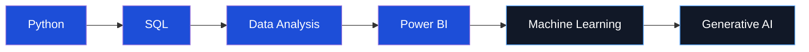

<!-- ========================================================= -->
<!--                    HERO SECTION                           -->
<!-- ========================================================= -->

<div align="center">


<br>


<br>

<a href="https://github.com/vikasinisenthilkumar52-hash"></a>
<a href="https://www.linkedin.com/in/vikasini-s-aa48932a4/"></a>
<a href="mailto:vikasinisenthilkumar52@gmail.com"></a>

<br><br>


</div>

<br>

<!-- ========================================================= -->
<!--                    WHOAMI                                  -->
<!-- ========================================================= -->

```bash
$ whoami
```

```yaml
name:         Vikasini Senthilkumar (Vikuu)
role:         Final-Year B.Tech — Artificial Intelligence & Data Science
institution:  PGP College of Engineering & Technology
cgpa:         8.32
graduating:   2027
location:     Namakkal, Tamil Nadu, IN
stack:        Python · SQL · Pandas · Power BI · Scikit-learn · NLP
status:       [ACTIVE] building data + AI portfolio
```

---

<!-- ========================================================= -->
<!--                    SKILL MATRIX                            -->
<!-- ========================================================= -->

## 📡 Skill Matrix

```text
Python              ████████████████████░░░░  80%
SQL                  ███████████████░░░░░░░░░  60%
Data Analysis (EDA)  ██████████████████░░░░░░  75%
Pandas / NumPy       ████████████████████░░░░  80%
Power BI             ███████████████████░░░░░  78%
Machine Learning     ██████████████░░░░░░░░░░  58%
NLP                  █████████████████░░░░░░░  68%
Generative AI        ██████████████░░░░░░░░░░  55%
```

<details>
<summary><b>⚙️ Full toolchain (click to expand)</b></summary>

| Layer | Tools |
|---|---|
| **Language** | Python, SQL |
| **Data Wrangling** | Pandas, NumPy |
| **Modeling** | Scikit-learn, NLP (VADER) |
| **Visualization** | Power BI, Matplotlib, Seaborn |
| **Scraping / Ingestion** | Requests, BeautifulSoup |
| **Environment** | Google Colab, VS Code |
| **Version Control** | Git, GitHub |

</details>

---

<!-- ========================================================= -->
<!--                    EXPERIENCE                              -->
<!-- ========================================================= -->

## 💼 Experience Log

```text
[2024–2025]  PlutoAcademy           → Data Analytics Intern
             └─ Applied EDA & reporting on real datasets

[2024–2025]  IBM SkillsBuild        → Intern (AICTE / BharatCares)
             └─ Industry-aligned upskilling program

[2024–2025]  CodeAlpha              → Data Analytics Intern
             └─ 4/4 tasks completed: EDA · Sentiment Analysis · Web Scraping
```

---

<!-- ========================================================= -->
<!--                    FEATURED PROJECTS                       -->
<!-- ========================================================= -->

## 🚀 Featured Projects

<table>
<tr>
<td width="50%" valign="top">

### 🛒 `ecommerce-sales-analytics`
```yaml
dataset:  Olist Brazilian E-Commerce
task:     Sales / category / regional analysis
stack:    [Python, Pandas, Matplotlib, Power BI]
```
[**→ Repository**](https://github.com/vikasinisenthilkumar52-hash/Ecommerce-Sales-Analysis)

</td>
<td width="50%" valign="top">

### 🎓 `student-performance-analysis`
```yaml
dataset:  Student performance records
task:     Correlation of education/prep vs scores
stack:    [Python, Pandas, Matplotlib, Seaborn]
```
[**→ Repository**](https://github.com/vikasinisenthilkumar52-hash/student-performance-analysis)

</td>
</tr>
<tr>
<td width="50%" valign="top">

### 🏪 `codealpha-eda-superstore`
```yaml
dataset:  Superstore sales
task:     Profit / discount / regional EDA
stack:    [Python, Pandas, Seaborn, SciPy, SQL]
```
[**→ Repository**](https://github.com/vikasinisenthilkumar52-hash/CodeAlpha_EDA)

</td>
<td width="50%" valign="top">

### 💬 `sentiment-analysis-nlp`
```yaml
dataset:  Amazon Fine Food Reviews
task:     Sentiment classification (VADER)
stack:    [Python, NLP, VADER, Pandas]
```
[**→ Repository**](https://github.com/vikasinisenthilkumar52-hash/CodeAlpha_SentimentAnalysis)

</td>
</tr>
<tr>
<td width="50%" valign="top">

### 📚 `web-scraping-pipeline`
```yaml
target:   Book catalog site
task:     Extract title/price/rating/availability
stack:    [Python, Requests, BeautifulSoup, Pandas]
```
[**→ Repository**](https://github.com/vikasinisenthilkumar52-hash/CodeAlpha_WebScraping)

</td>
<td width="50%" valign="top">

### 🤖 `mindpulseai`
```yaml
type:     AI application prototype
task:     Practical intelligent data-driven app
stack:    [Python, AI, Data]
```
[**→ Repository**](https://github.com/vikasinisenthilkumar52-hash/MindPulseAI)

</td>
</tr>
</table>

<div align="center">

[](https://github.com/vikasinisenthilkumar52-hash?tab=repositories)

</div>

---

<!-- ========================================================= -->
<!--                    ROADMAP                                 -->
<!-- ========================================================= -->

## 🧭 Build Roadmap



| Track | Status |
|---|---|
| EDA projects | ✅ Done |
| Real-world datasets | ✅ Done |
| Power BI dashboards | ✅ Done |
| Advanced SQL | 🔄 In progress |
| NLP | ✅ Done |
| Generative AI | 🔄 Exploring |
| More AI projects | ⬜ Planned |
| Core Machine Learning | 🔄 Strengthening |

---

<!-- ========================================================= -->
<!--                    GITHUB STATS                            -->
<!-- ========================================================= -->

## 📊 GitHub Activity

<div align="center">


<br><br>


<br><br>


</div>

---

<!-- ========================================================= -->
<!--                    CONNECT                                 -->
<!-- ========================================================= -->

<div align="center">

## 📡 Connect

```bash
$ contact --open-to internships,collaboration,data-ai-roles
```

<a href="https://www.linkedin.com/in/vikasini-s-aa48932a4/"></a>
<a href="mailto:vikasinisenthilkumar52@gmail.com"></a>
<a href="https://github.com/vikasinisenthilkumar52-hash"></a>

<br><br>


</div>


